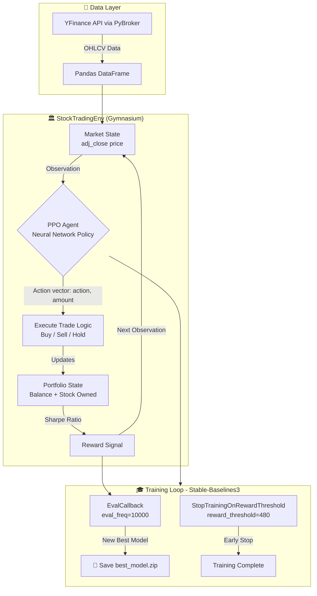
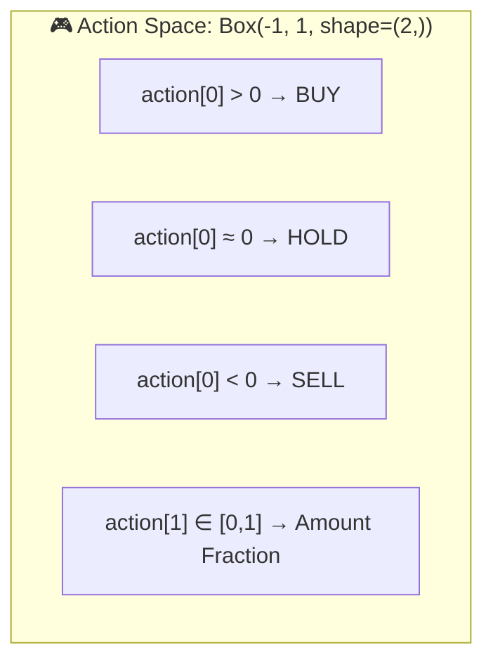
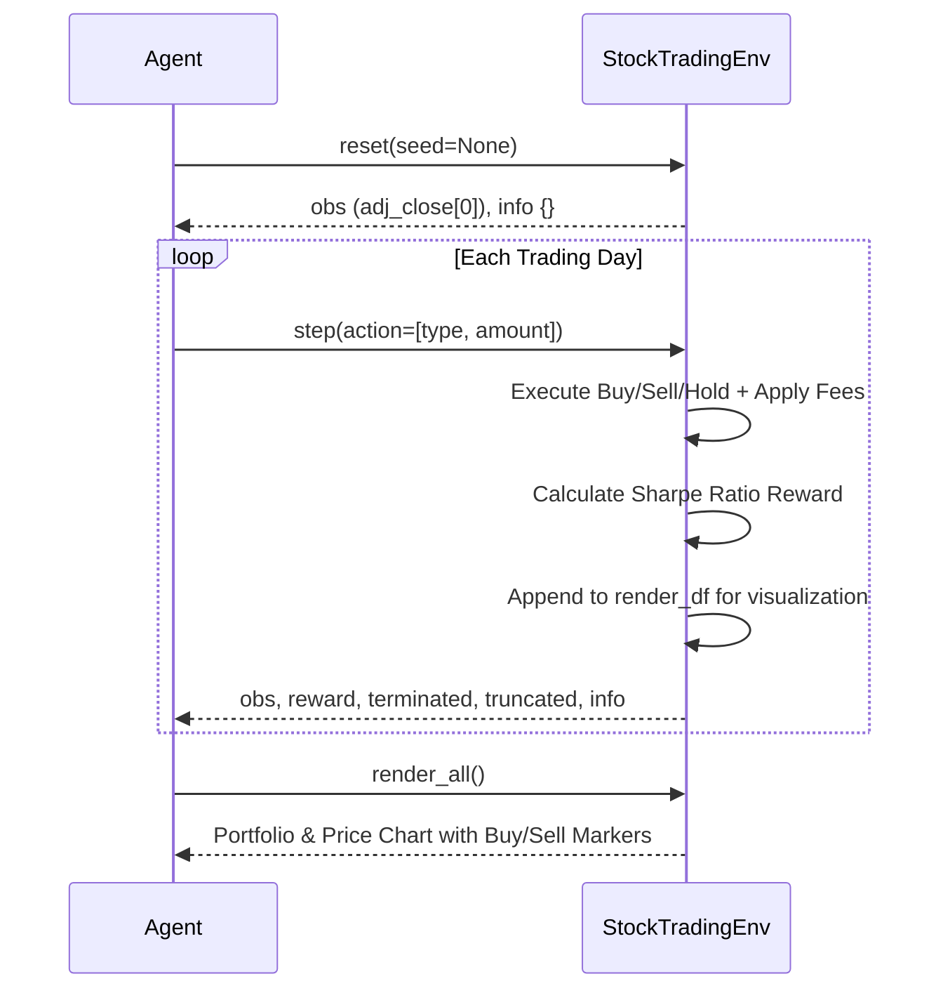
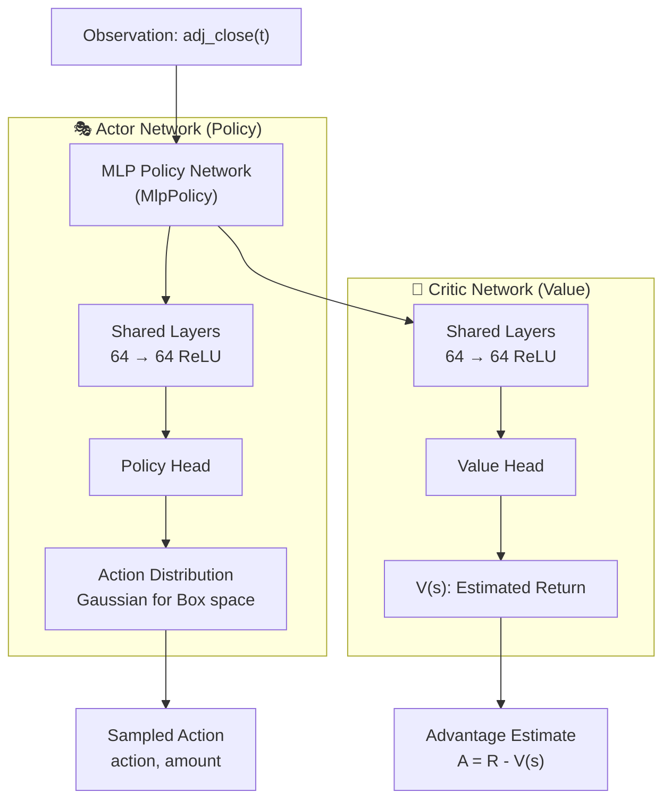
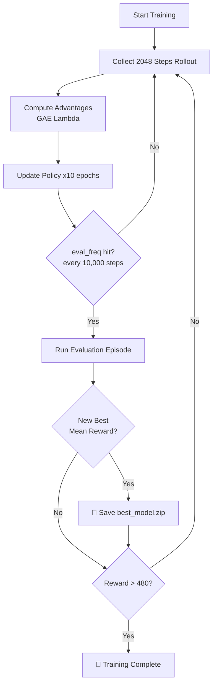

<div align="center">

# 🤖 RL Stock Trading Agent

<p>
  
  
  
  
  
</p>

<p>
  <b>A production-grade Deep Reinforcement Learning system that trains a PPO agent to autonomously trade stocks in a custom Gymnasium environment, optimizing for Sharpe Ratio with realistic commission and slippage modeling.</b>
</p>

</div>

---

## 📑 Table of Contents

1. [Project Overview](#-project-overview)
2. [Repository Structure](#-repository-structure)
3. [System Architecture](#-system-architecture)
4. [Custom Trading Environment](#-custom-trading-environment-tradingenvpy)
5. [The RL Agent (PPO)](#-the-rl-agent-ppo)
6. [Reward Engineering](#-reward-engineering--sharpe-ratio)
7. [Training Pipeline](#-training-pipeline)
8. [Results & Visualization](#-results--visualization)
9. [Installation & Usage](#-installation--usage)
10. [Technical Reference](#-technical-reference)

---

## 🌟 Project Overview

This project implements an **end-to-end Reinforcement Learning framework** for algorithmic stock trading. An AI agent learns to make optimal buy/sell/hold decisions by interacting with a realistic, custom-built stock market simulation environment. The system is built on three core pillars:

| Pillar | Technology | Role |
| :--- | :--- | :--- |
| **Custom Environment** | `Gymnasium` | OpenAI-compatible market simulator with costs |
| **RL Algorithm** | `Stable-Baselines3 PPO` | Proximal Policy Optimization agent |
| **Data Source** | `PyBroker + YFinance` | Live historical OHLCV data fetching |
| **Reward Signal** | `Sharpe Ratio` | Risk-adjusted performance optimization |
| **Hardware** | `Apple MPS / CUDA` | GPU-accelerated policy training |

---

## 📁 Repository Structure

```
Trading_with_Rein/
│
├── TradingEnv.py                    # 🏛️ Custom Gymnasium Environment (StockTradingEnv)
├── Trading_bot-reinforcment.ipynb   # 🧠 PPO Training & Evaluation Notebook
├── Trading_bot.ipynb                # 📊 Multi-Model Analysis (LSTM, Transformer, RF)
├── Stock_data.csv                   # 📈 Historical Stock Data
│
└── Training/
    └── Saved Models/
        └── best_model.zip           # 💾 Best Checkpoint (saved by EvalCallback)
```

---

## 🏗️ System Architecture

The core loop of this project is the classic **Agent ↔ Environment** interaction cycle of Reinforcement Learning.



---

## 🏛️ Custom Trading Environment (`TradingEnv.py`)

The `StockTradingEnv` class is the heart of this project. It inherits from `gymnasium.Env` and implements a realistic market simulation with transaction costs.

### Class Signature

```python
class StockTradingEnv(gym.Env):
    def __init__(
        self,
        data,                      # Pandas DataFrame with 'date' and 'adj_close'
        initial_balance = 10000,   # Starting portfolio cash
        commission_fee  = 0.01,    # Per-trade commission (1%)
        slippage_cost   = 0.1      # Market slippage factor (10%)
    )
```

### Action & Observation Space

| Space | Type | Shape | Description |
| :--- | :--- | :--- | :--- |
| **Action Space** | `Box` | `(2,)` | `[action_type, amount]`. Action: `> 0` = Buy, `< 0` = Sell, `≈ 0` = Hold |
| **Observation Space** | `Box` | `(1,)` | Current adjusted closing price `adj_close[t]` |



### Environment Lifecycle



### Transaction Cost Model

The environment enforces realistic transaction costs to prevent the agent from over-trading:

```python
# BUY: Deduct commission and slippage from balance
balance -= price * shares * (1 + commission_fee + slippage_cost)

# SELL: Receive balance minus commission and slippage
balance += price * shares * (1 - commission_fee - slippage_cost)
```

---

## 🧠 The RL Agent (PPO)

The agent is a **Proximal Policy Optimization (PPO)** model from `stable-baselines3`. PPO is a state-of-the-art policy gradient algorithm known for its stability and sample efficiency.

### PPO Architecture



### PPO Hyperparameters (Training Run)

| Parameter | Value | Description |
| :--- | :--- | :--- |
| `algorithm` | `PPO` | Proximal Policy Optimization |
| `policy` | `MlpPolicy` | Multilayer Perceptron |
| `learning_rate` | `0.0003` | Adam optimizer step size |
| `clip_range` | `0.2` | PPO clipping parameter `ε` |
| `n_steps` | `2048` | Steps per rollout collection |
| `device` | `mps` | Apple Metal GPU acceleration |

---

## 📐 Reward Engineering — Sharpe Ratio

The agent's reward is not naive profit — it's the **Sharpe Ratio**, a risk-adjusted performance metric. This incentivizes the agent to maximize returns *while minimizing volatility*, producing more stable and professional trading strategies.

$$\text{Sharpe} = \frac{R_p - R_f}{\sigma_p}$$

Where:
- $R_p$ = Excess portfolio return at step `t`
- $R_f$ = Risk-free rate (`0.02` annualized)
- $\sigma_p$ = Rolling standard deviation of price history up to step `t`

```python
# From TradingEnv.py — step() method
excess_return = current_portfolio_value - prev_portfolio_value
risk_free_rate = 0.02
std_deviation  = np.std(self.stock_price_history[:self.current_step + 1])
sharpe_ratio   = (excess_return - risk_free_rate) / std_deviation if std_deviation != 0 else 0
reward = sharpe_ratio
```

> **Why Sharpe Ratio?** A simple P&L reward encourages the agent to take huge, volatile bets. The Sharpe Ratio penalizes this behavior, pushing the agent to find **consistent, low-risk alpha**.

---

## 🎓 Training Pipeline

The training notebook (`Trading_bot-reinforcment.ipynb`) orchestrates the full pipeline:

### Step 1 — Data Acquisition
```python
from pybroker import YFinance
yfinance = YFinance()
# Fetch 5 years of AAPL daily data
df = yfinance.query(['AAPL'], start_date='3/1/2021', end_date='3/1/2026')
df['date'] = pd.to_datetime(df['date']).dt.date
```

### Step 2 — Environment Construction
```python
env = StockTradingEnv(
    df,
    initial_balance = 100_000,   # $100k paper trading account
    commission_fee  = 0.0001,    # 0.01% (realistic broker fee)
    slippage_cost   = 0.005      # 0.5% slippage
)
```

### Step 3 — Agent & Callbacks
```python
# Stop training when reward exceeds threshold
stop_callback = StopTrainingOnRewardThreshold(reward_threshold=480, verbose=1)

# Evaluate every 10k steps & save the best model
eval_callback = EvalCallback(
    env,
    callback_on_new_best = stop_callback,
    eval_freq             = 10000,
    best_model_save_path  = 'Training/Saved Models/',
    verbose               = 1
)

# Initialize PPO on Apple MPS GPU
model = PPO('MlpPolicy', env, verbose=1, device='mps')
```

### Step 4 — Training & Evaluation Loop


### Training Progress (Sample Output)

The model was observed to improve from negative rewards towards positive, confirming learning:

| Timesteps | `ep_rew_mean` | Notes |
| :--- | :--- | :--- |
| `2,048` | `-1,000` | Initial random exploration |
| `10,000` | `-1.72` | Eval baseline established |
| `24,576` | `-9.82` | Breaking even |
| `26,624` | `+506` | 🔼 First positive episode |
| `43,008` | `+1,500` | Strong improvement |
| `45,056+` | `+1,660+` | Sustained positive returns |

---

## 📊 Results & Visualization

After training, the environment's `render_all()` method generates a comprehensive portfolio chart:

```python
# Load the best trained model
model = PPO.load("Training/Saved Models/best_model")

# Run a full episode for visualization
obs, _ = env.reset()
done = False
while not done:
    action, _ = model.predict(obs)
    obs, reward, terminated, truncated, info = env.step(action)
    done = terminated or truncated

# Plot the full trade history
env.render_all()
```

**Chart Features:**
- 📈 **Portfolio Value** (light grey dashed line) vs. **Stock Price** (black line, right axis)
- 🟢 **Buy signals** shown as green upward triangles `▲` with share count labels
- 🔴 **Sell signals** shown as red downward triangles `▼` with share count labels

---

## 🛠️ Installation & Usage

### Prerequisites

```bash
# Core dependencies
pip install gymnasium stable-baselines3 pybroker pandas numpy matplotlib
```

### Quick Start

```bash
# 1. Clone the repository
git clone https://github.com/alikhalidalikhalid/Trading_with_Rein.git
cd Trading_with_Rein

# 2. Open the training notebook
jupyter notebook Trading_bot-reinforcment.ipynb

# 3. Run all cells sequentially
# Data → Environment → Model → Training → Evaluation → Visualization
```

### Loading a Pre-trained Model

```python
from stable_baselines3 import PPO
from TradingEnv import StockTradingEnv

# Load environment with new data
env = StockTradingEnv(your_df, initial_balance=100_000)

# Load best saved model
model = PPO.load("Training/Saved Models/best_model", env=env)

# Evaluate
from stable_baselines3.common.evaluation import evaluate_policy
mean_reward, std_reward = evaluate_policy(model, env, n_eval_episodes=5)
print(f"Mean Reward: {mean_reward:.2f} ± {std_reward:.2f}")
```

---

## 📚 Technical Reference

### `StockTradingEnv` API

| Method | Signature | Description |
| :--- | :--- | :--- |
| `reset` | `(seed=None) → (obs, info)` | Reset environment to initial state |
| `step` | `(action) → (obs, reward, done, false, info)` | Execute one trading step |
| `_get_observation` | `() → np.ndarray` | Returns current price as observation |
| `render` | `(action, amount, portfolio_val, mode)` | Log step to render DataFrame |
| `render_all` | `()` | Plot full trade history chart |

### Key Dependencies

| Library | Version | Purpose |
| :--- | :--- | :--- |
| `gymnasium` | `>=0.26` | RL Environment interface (new API) |
| `stable-baselines3` | `>=2.0` | PPO implementation |
| `pybroker` | `latest` | Market data fetching & caching |
| `pandas` | `>=1.5` | Data manipulation |
| `numpy` | `>=1.23` | Numerical computation |
| `matplotlib` | `>=3.5` | Trade visualization |

---

<div align="center">

**Built with ❤️ by [Ali Khalid](https://github.com/alikhalidalikhalid)**

*Reinforcement Learning · Algorithmic Trading · Apple Silicon*

</div>
